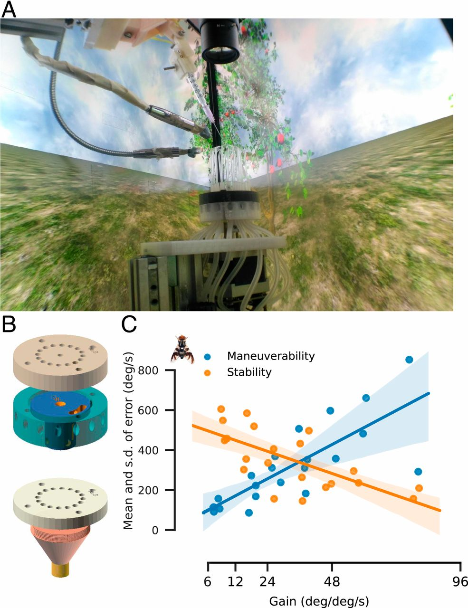

# MultiMoVR - Multimodal Virtual Reality Arena

A comprehensive virtual reality system for behavioral experiments with real-time tracking, multimodal stimulus delivery, and data collection. This system integrates camera-based tracking (Kinefly), ROS communication, 3D visualization (Panda3D), and hardware control for creating immersive experimental environments for insect behavioral studies.

## 🎥 Watch the PhD Defense Video

[](https://www.youtube.com/watch?v=nvKbHqxlY7s&themeRefresh=1)

**[▶️ PhD Defense Presentation](https://www.youtube.com/watch?v=nvKbHqxlY7s&themeRefresh=1)** - Comprehensive overview of the research and system capabilities

## 📚 Key Resources

- **📄 PNAS Paper**: [Multimodal virtual reality arena for behavioral experiments](https://www.pnas.org/doi/10.1073/pnas.1912124117)
- **📖 PhD Thesis**: [Complete thesis documentation and methodology](https://zenodo.org/records/8333399)
- **🐳 Improved Kinefly**: [Enhanced Docker-based Kinefly](https://github.com/pvnkmrksk/Kinefly_Docker) - One-command startup with better error handling

## System Overview

MultiMoVR provides:
- **Real-time tracking**: Camera-based wing beat amplitude detection using Kinefly
- **3D Virtual Environments**: Immersive visual environments with wind and odor fields
- **Multimodal Stimuli**: Simultaneous visual, wind, and odor delivery
- **Hardware Integration**: Custom-built wind/odor delivery system with 16 capillaries
- **Data Collection**: Comprehensive logging of behavioral and experimental data
- **ROS Integration**: Distributed system architecture for scalability

### System Components


*Figure 1: MultiMoVR system components. (A) Experimental setup showing the virtual reality environment with naturalistic scenery and the physical apparatus including the wind/odor delivery system and camera tracking. (B) 3D rendered exploded views of the custom-built 16-capillary wind/odor delivery system components. (C) Graph showing the relationship between gain and system performance, demonstrating the trade-off between maneuverability and stability.*

## Hardware Requirements

### Core Components
- **High-refresh-rate gaming monitors**: Asus ROG PG279Q (165 Hz IPS panel) for visual display
- **Camera**: Modified PS3 Eye camera (187 fps) with custom C-mount lens
- **Wind/Odor Delivery**: Custom-built 16-capillary system with stepper motor control
- **Frame**: 1m³ aluminum profile extrusion frame
- **Computer**: Gaming PC with i7-5690K CPU, NVIDIA 980 TI GPU, 32 GB RAM

### System Specifications
- **Visual Field**: 360° horizontal, 140° vertical field of view
- **Latency**: Visual (66ms), Wind (36ms), Odor (60ms ± 4ms)
- **Virtual World**: 1025m × 1025m with periodic boundaries
- **Translational Velocity**: 0.5-1 m/s (configurable)
- **Luminosity**: ~1000 lux at insect location

## Bill of Materials

### Core System Components

| S/L No | Item | Description | Quantity | Rate (USD) | Cost (USD) |
|--------|------|-------------|----------|------------|------------|
| 1 | 2020 aluminum frame | Generic extrusions | 12 m | 5.6 | 67 |
| 2 | T-Profile nuts, corner brackets | Generic extrusion attachments | 30 | 0.7 | 21 |
| 3 | XY plane DSLR macro slider | Neewer pro 4-way macro focus rail 10033981 | 1 | 28 | 28 |
| 4 | Ball socket DSLR tripod head | Generic swivel head | 1 | 4 | 4 |
| 5 | Web camera with IR hack | Sony PS3 eye, hacked for IR pass and allow C-mount | 1 | 4 | 4 |
| 6 | Varifocal C-mount Lens | Pashay CP550 5-50mm C mount lens | 1 | 21 | 21 |
| 7 | Closed loop stepper motor | uStepper NEMA 17 | 1 | 70 | 70 |
| 8 | Arduino microcontroller | Arduino Uno | 1 | 4 | 4 |
| 9 | MOSFET relay | Generic IRF540 module | 1 | 1 | 1 |
| 10 | High speed 3/2 solenoid valve | Landefeld M3M5 ES 24 V | 1 | 140 | 140 |
| 11 | Custom odor bottle | PEEK custom CNC milled | 2 | 28 | 56 |
| 12 | Tubing connectors and accessories | Generic T,Y and elbow push fit connectors | 20 | 0.7 | 14 |
| 13 | 3D printed parts | Wind delivery system, lens holders, manipulators | 20 h | 2 | 40 |
| 14 | IR emitter | SFH 4550, Osram | 2 | 1 | 2 |
| | **Sub Total** | | | | **473** |

### Optional Computer Accessories

| S/L No | Item | Description | Quantity | Rate (USD) | Cost (USD) |
|--------|------|-------------|----------|------------|------------|
| 15 | Gaming monitors | ASUS ROG Swift PG279q | 3 | 1050 | 3149 |
| 16 | CPU | Intel Core i7-5820K Haswell-E 6-Core | 1 | 448 | 448 |
| 17 | Motherboard | Asus X99 Sabertooth | 1 | 448 | 448 |
| 18 | GPU | Asus Geforce GTX 980 Ti | 1 | 910 | 910 |
| 19 | RAM | G.SKILL 32GB (8GB X 4) DDR4 | 1 | 224 | 224 |
| 20 | SMPS | Antec VP700EC SMPS | 1 | 98 | 98 |
| 21 | SSD | Samsung 850 Pro 512GB | 2 | 448 | 896 |
| 22 | HDD | Seagate HDD 4 TB desktop | 1 | 154 | 154 |
| 23 | Chassis | Cooler Master 690 chassis | 1 | 168 | 168 |
| | **Sub Total** | | | | **6495** |

**Total System Cost**: $6,968 USD (including optional computer accessories)

## Software Requirements

### Operating System
- **Ubuntu 14.04 LTS** (original implementation) or **Ubuntu 18.04 LTS** (updated)
- **ROS Indigo** (Ubuntu 14.04) or **ROS Melodic** (Ubuntu 18.04)
- **Python 2.7** with scientific computing packages
- **Panda3D** 3D graphics engine
- **Qt4** GUI framework

### Key Dependencies
- **Kinefly**: Wing beat amplitude detection ([Improved Docker version](https://github.com/pvnkmrksk/Kinefly_Docker))
- **ROS packages**: roscpp, rospy, std_msgs, geometry_msgs
- **Python packages**: pandas, scipy, seaborn, pyqtgraph, numpy
- **Camera support**: usb_cam, uvc_camera packages

## Installation Guide

### 1. System Setup

Update your system and install essential packages:

```bash
sudo apt-get update
sudo apt-get install fail2ban ufw terminator git v4l-utils -y
```

### 2. ROS Installation

#### For Ubuntu 14.04 LTS (ROS Indigo):

```bash
# Add ROS repository
sudo sh -c 'echo "deb http://packages.ros.org/ros/ubuntu trusty main" > /etc/apt/sources.list.d/ros-latest.list'
wget https://raw.githubusercontent.com/ros/rosdistro/master/ros.key -O - | sudo apt-key add -

# Install ROS
sudo apt-get update
sudo apt-get install ros-indigo-desktop-full -y

# Setup ROS environment
source /opt/ros/indigo/setup.bash
mkdir -p ~/catkin/src
cd ~/catkin/src
catkin_init_workspace
cd ~/catkin
catkin_make

# Add to bashrc
echo "source ~/catkin/devel/setup.bash" >> ~/.bashrc
sudo -E rosdep init
rosdep update
source ~/.bashrc
```

#### For Ubuntu 18.04 LTS (ROS Melodic):

```bash
# Add ROS repository
sudo sh -c 'echo "deb http://packages.ros.org/ros/ubuntu bionic main" > /etc/apt/sources.list.d/ros-latest.list'
sudo apt-key adv --keyserver 'hkp://keyserver.ubuntu.com:80' --recv-key C1CF6E31E6BADE8868B172B4F42ED6FBAB17C654

# Install ROS
sudo apt update
sudo apt install ros-melodic-desktop-full -y

# Setup ROS environment
source /opt/ros/melodic/setup.bash
mkdir -p ~/catkin_ws/src
cd ~/catkin_ws/src
catkin_init_workspace
cd ~/catkin_ws
catkin_make

# Add to bashrc
echo "source ~/catkin_ws/devel/setup.bash" >> ~/.bashrc
sudo rosdep init
rosdep update
source ~/.bashrc
```

### 3. Camera Setup

Install USB camera support:

```bash
sudo apt-get install libv4l-dev -y
cd ~/catkin/src
git clone https://github.com/bosch-ros-pkg/usb_cam.git
cd ~/catkin
catkin_make
```

Install UVC camera support:

```bash
cd ~/catkin/src
git clone https://github.com/ktossell/camera_umd.git
rosdep install camera_umd uvc_camera jpeg_streamer
cd ~/catkin
catkin_make
```

### 4. Kinefly Installation

Install dependencies for Kinefly:

```bash
sudo apt-get install -y python-rosinstall ros-indigo-cmake-modules python-setuptools python-numpy python-scipy libdc1394-22-dev intltool gobject-introspection
```

Setup Kinefly:

**Option 1: Traditional Installation**
```bash
mkdir ~/src.git
echo "export ROS_PACKAGE_PATH=~/src.git:~/src.hg:~/catkin:$ROS_PACKAGE_PATH" >> ~/.bashrc

# Get required ROS packages
cd ~/src.git
git clone https://github.com/ssafarik/ledpanels
git clone https://github.com/ssafarik/phidgets
git clone https://github.com/pvnkmrksk/Kinefly.git

# Setup udev rules
sudo cp ~/src.git/Kinefly/udev/99-phidgets.rules /etc/udev/rules.d

# Build Kinefly
rosmake Kinefly

# Configure rig
cd Kinefly/launch
echo "export RIG=rhag" >> ~/.bashrc
source ~/.bashrc
```

**Option 2: Improved Docker Version (Recommended)**
For easier setup and better portability, use the [Kinefly Docker version](https://github.com/pvnkmrksk/Kinefly_Docker):

```bash
# Clone the improved Kinefly Docker repository
git clone https://github.com/pvnkmrksk/Kinefly_Docker.git
cd Kinefly_Docker

# One command to start everything
./dev-kinefly.sh          # Start Kinefly + ZMQ bridge on port 9871
./dev-kinefly.sh 9872     # Custom port

# Features include:
# - One command startup
# - Configurable ports
# - Graceful shutdown
# - Automatic cleanup
# - Easy configuration management
```

### 5. Python Dependencies

Install Python packages:

```bash
sudo apt-get install python-pip -y
sudo -E -H pip install json_tricks easygui pandas jupyter seaborn pyqtgraph rosbag_pandas pathlib arduino_python
sudo apt-get install ros-indigo-rospy-message-converter python-skimage python-skimage-doc -y
```

### 6. MultiMoVR Installation

Clone and setup the MultiMoVR system:

```bash
cd ~/catkin/src
git clone --depth 1 https://github.com/pvnkmrksk/world.git
mv world World
cd ~/catkin
catkin_make
```

### 7. Panda3D Installation

Install the 3D graphics engine:

```bash
wget https://www.panda3d.org/download/panda3d-1.9.3/panda3d1.9_1.9.3~trusty_amd64.deb
sudo apt-get install dpkg
sudo dpkg -i panda3d1.9_1.9.3~trusty_amd64.deb
```

### 8. GUI Development Tools

Install Qt4 for GUI development:

```bash
sudo apt-get install python-qt4 pyqt4-dev-tools qt4-designer -y
```

### 9. Final Setup

Restart your system to ensure all changes take effect:

```bash
sudo reboot
```

## Usage

### Starting the System

1. **Launch ROS core**:
   ```bash
   roscore
   ```

2. **Start camera tracking** (in a new terminal):
   ```bash
   roslaunch uvc_camera camera_node.launch
   ```

3. **Launch Kinefly** (in a new terminal):
   ```bash
   roslaunch Kinefly main.launch
   ```

4. **Run the MultiMoVR system** (in a new terminal):
   ```bash
   cd ~/catkin/src/World
   python main.py
   ```

### Experimental Protocols

The system supports multiple experimental paradigms:

#### Visual Assay
- Four virtual worlds: object left, object right, no object, objects both sides
- Gain optimization for species-specific optimal ranges
- Distance assays with different initial positions

#### Windscape Assay
- Four wind conditions: open-loop, easterly, westerly, northerly
- Directional airflow cues from 16-capillary system
- Variable airflow velocities

#### Odor Assay
- Combined wind and odor delivery
- 2m-wide rectangular odor strips with gradient
- 1-10 Hz packet frequency over 25m distance

### Configuration

The system uses JSON configuration files located in `GUI/jsonFiles/` to define experimental parameters. Key configuration options include:

- **Experiment types**: Visual, wind, odor, and combined assays
- **Stimulus parameters**: Wind fields, odor delivery, visual cues
- **Hardware settings**: Stepper motor control, valve timing, sensor calibration
- **Data logging**: Recording parameters and output formats

### GUI Interface

Launch the graphical interface:

```bash
cd ~/catkin/src/World
python GUI.py
```

## System Architecture

### ROS Node Structure
- **Camera Node**: Preprocesses and publishes live camera stream
- **Kinefly Node**: Analyzes stream and publishes wing beat angles
- **VR Node**: Computes trajectory and stimulus states using WBAD
- **GUI Node**: Provides real-time visualization and control

### Key Algorithms

**Wing Beat Amplitude Difference (WBAD)**:
```
WBAD = LeftWingAmplitude - RightWingAmplitude
NewHeading = CurrentHeading - Gain × WBAD
```

**Speed Control (WBAS)**:
```
WBAS = LeftWingAmplitude + RightWingAmplitude
NewSpeed = (MaxSpeed - MinSpeed) × (WBAS - MinWBAS) / (MaxWBAS - MinWBAS)
```

## Project Structure

```
World/
├── classes/           # Core system classes (MyApp, Player, Environment)
├── exprmts/          # Experiment implementations (circ, lr, gain, maze, pf)
├── GUI/              # User interface and configuration files
├── helping/          # Utility functions and parameter definitions
├── arduino/          # Arduino control code for hardware
├── msg/              # ROS message definitions
├── models/           # 3D models and textures
└── main.py           # Main application entry point
```

## Troubleshooting

### Common Issues

1. **Camera not detected**: Check USB connections and run `lsusb` to verify device recognition
2. **ROS communication errors**: Ensure roscore is running and all nodes are properly sourced
3. **Permission errors**: Check udev rules installation and user permissions for hardware access
4. **Python import errors**: Verify all dependencies are installed and Python path is correct
5. **Wing tracking issues**: Adjust DC offset parameter for each insect to ensure symmetrical WBAD distribution

### Performance Optimization

- Use gaming-grade hardware for optimal performance
- Ensure adequate cooling for sustained high-performance operation
- Monitor system resources during long experimental sessions

## Active Development

**Note for archival value**: This repository contains the legacy Panda3D-based implementation of the MultiMoVR system. A new, state-of-the-art version is currently under active development using Unity Engine, featuring enhanced performance, modern VR capabilities, and improved user experience.

**New Unity-based version**: [MATREX VR](https://github.com/pvnkmrksk/matrexVR) - Bridging Virtual Reality and Naturalistic Behaviors in Neuroscience

The new MATREX VR system offers:
- **Modern Unity Engine**: Enhanced 3D graphics and performance
- **Advanced VR Integration**: State-of-the-art virtual reality capabilities
- **Parametric 3D Printable Modules**: Scalable design for various organisms
- **6-axis Force-Torque Sensors**: Advanced sensory system for behavioral analysis
- **Open Source Architecture**: Democratized access to VR research tools

## Contributing

Contributions to this legacy system are welcome! Please ensure any modifications maintain compatibility with the existing ROS-based architecture and follow the established coding conventions.

For the latest developments and contributions, please refer to the [MATREX VR repository](https://github.com/pvnkmrksk/matrexVR).

## License

This project is licensed under the MIT License - see the [LICENSE](LICENSE) file for details.

```
MIT License

Copyright (c) 2024 MultiMoVR Contributors

Permission is hereby granted, free of charge, to any person obtaining a copy
of this software and associated documentation files (the "Software"), to deal
in the Software without restriction, including without limitation the rights
to use, copy, modify, merge, publish, distribute, sublicense, and/or sell
copies of the Software, and to permit persons to whom the Software is
furnished to do so, subject to the following conditions:

The above copyright notice and this permission notice shall be included in all
copies or substantial portions of the Software.

THE SOFTWARE IS PROVIDED "AS IS", WITHOUT WARRANTY OF ANY KIND, EXPRESS OR
IMPLIED, INCLUDING BUT NOT LIMITED TO THE WARRANTIES OF MERCHANTABILITY,
FITNESS FOR A PARTICULAR PURPOSE AND NONINFRINGEMENT. IN NO EVENT SHALL THE
AUTHORS OR COPYRIGHT HOLDERS BE LIABLE FOR ANY CLAIM, DAMAGES OR OTHER
LIABILITY, WHETHER IN AN ACTION OF CONTRACT, TORT OR OTHERWISE, ARISING FROM,
OUT OF OR IN CONNECTION WITH THE SOFTWARE OR THE USE OR OTHER DEALINGS IN THE
SOFTWARE.
```

## Citation

If you use this software in your research, please cite:

```bibtex
@article{multimovr2024,
  title={Multimodal virtual reality arena for behavioral experiments},
  author={[Authors]},
  journal={Proceedings of the National Academy of Sciences},
  volume={[Volume]},
  number={[Number]},
  pages={[Pages]},
  year={2024},
  publisher={National Academy of Sciences},
  doi={10.1073/pnas.1912124117},
  url={https://www.pnas.org/doi/10.1073/pnas.1912124117}
}
```

**APA Format:**
[Authors]. (2024). Multimodal virtual reality arena for behavioral experiments. *Proceedings of the National Academy of Sciences*, [Volume]([Number]), [Pages]. https://doi.org/10.1073/pnas.1912124117

## Acknowledgements

- **Kinefly**: Wing beat amplitude detection system ([Improved Docker version](https://github.com/pvnkmrksk/Kinefly_Docker))
- **Panda3D**: 3D graphics engine
- **ROS**: Robot Operating System framework
- **Asus ROG**: High-refresh-rate gaming monitors
- **Custom hardware**: Wind/odor delivery system and camera modifications